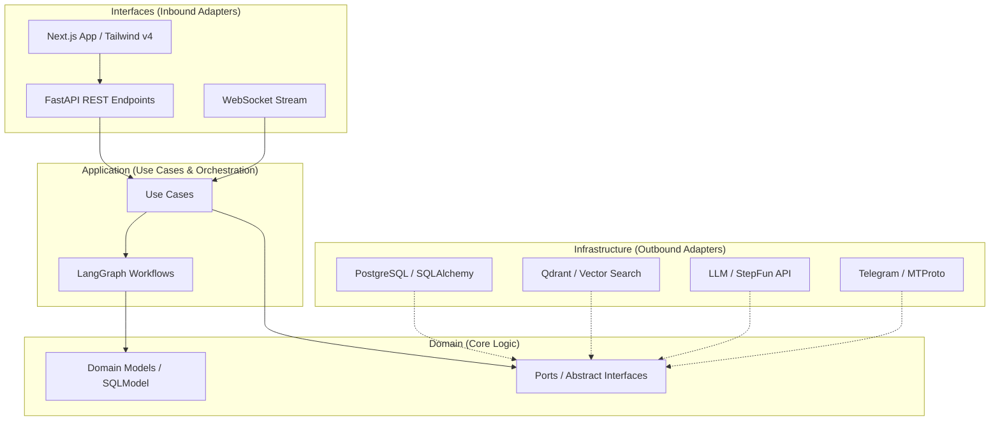

# EMACE: Ecosistema Multi-Agente Cognitivo Enterprise

## 1. Visión General
**EMACE** es una plataforma de asistencia inteligente **proactiva** y **Multi-Tenant (B2B2C)** capaz de resolver consultas complejas y ejecutar acciones en el mundo real. Diseñada para operar como un SaaS, permite que múltiples Vendedores (Users) gestionen sus propios negocios y Clientes Finales (Customers) de forma aislada y segura.

---

## 2. Arquitectura del Sistema: Ports & Adapters (Hexagonal)

El backend de EMACE está diseñado siguiendo los principios de la **Arquitectura Hexagonal**, lo que garantiza que la lógica de negocio (el núcleo) sea independiente de las tecnologías externas (base de datos, frameworks web, APIs de terceros).

### 2.1 Capas de la Arquitectura y Reglas de Dependencia

El sistema se rige por la **Regla de Dependencia**: las dependencias solo pueden apuntar hacia adentro, hacia el Dominio.

1.  **Dominio (Domain)**: El corazón del sistema. Contiene las entidades de negocio ([models](file:///home/userl/projects/emace/backend/app/domain/models)), los esquemas de validación ([schemas](file:///home/userl/projects/emace/backend/app/domain/schemas)) y las definiciones de los **Puertos** (interfaces abstractas para repositorios y servicios externos). **Regla: No conoce a ninguna otra capa.**
2.  **Aplicación (Application)**: Orquesta el flujo de datos. Contiene los **Casos de Uso** ([use_cases](file:///home/userl/projects/emace/backend/app/application/use_cases)) que implementan la lógica de orquestación y los flujos cognitivos definidos en **LangGraph** ([graph](file:///home/userl/projects/emace/backend/app/application/graph)). **Regla: Depende solo de Domain.**
3.  **Infraestructura (Infrastructure)**: Implementa los adaptadores de salida. Contiene la configuración técnica ([config](file:///home/userl/projects/emace/backend/app/infrastructure/config.py)), la persistencia en base de datos ([repositories](file:///home/userl/projects/emace/backend/app/infrastructure/repositories)) y las integraciones con servicios externos como LLMs, Qdrant y Telegram ([adapters](file:///home/userl/projects/emace/backend/app/infrastructure/adapters)). **Regla: Implementa los Puertos de Domain y puede usar Application.**
4.  **Interfaces (Interfaces)**: Adaptadores de entrada. Puntos por donde el mundo exterior interactúa con la aplicación, incluyendo la [API REST](file:///home/userl/projects/emace/backend/app/interfaces/api), WebSockets y el [Dashboard](file:///home/userl/projects/emace/backend/app/interfaces/dashboard) administrativo. **Regla: Inyecta casos de uso de Application.**

### 2.2 Diagrama de Flujo y Componentes

---

## 3. Componentes del Sistema

### 3.1 Interfaz de Usuario y Experiencia (Evolución: Industrial Command Center)
- **Concepto "Operador"**: El usuario interactúa como un supervisor de misiones, utilizando una interfaz que proyecta control, precisión y proactividad.
- **Estética Neo-Glassmorphism Refinado**:
    - **Superficies**: Paneles con `backdrop-blur(20px)` y bordes de cristal (gradientes de 1px).
    - **Atmósfera**: Fondos oscuros con textura de grano (grain) y gradientes de malla (mesh) en tonos acero y medianoche.
- **Tipografía**: Dualidad entre fuentes suizas técnicas (`Aeonik/FK Grotesk`) para la UI y fuentes monoespaciadas (`JetBrains Mono`) para datos y logs de agentes.
- **Acentos Cromáticos**: Uso estratégico de `Safety Orange` (#FF5F1F) para elementos críticos y `Cyber Lime` para operatividad activa.
- **Comunicación Type-Safe**: Cliente API generado automáticamente desde OpenAPI.
- **Real-time Chat**: Terminal de comando persistente con WebSockets.

### 3.2 Gestión de Identidad y Seguridad
- **Middleware de Contexto**: Intercepta cada petición, valida el `user_id` (vía JWT) y lo inyecta en el `RunnableConfig` de LangGraph.
- **Aislamiento**: Garantiza que ningún agente pueda acceder a datos de otro Vendedor.
- **Cookies Seguras**: Manejo de tokens de sesión mediante cookies con interceptores de Axios para renovación automática.

### 3.3 El Supervisor (Orquestador)
- **Rol**: Director de orquesta. No resuelve tareas, las delega.
- **Responsabilidad**: Entender la intención y mantener el estado global.
- **Lógica**: StateGraph de LangGraph con soporte para subgrafos.

### 3.4 Agentes Especialistas (Workers)
Cada agente opera dentro del contexto del `user_id` inyectado. Siguiendo el plan de modernización de **workflows explícitos**, cada especialista ya no es un agente "caja negra", sino un subgrafo estructurado con control determinista.

**Arquitectura Interna del Especialista (Subgrafo):**
1.  **RAG Node**: Recupera contexto documental relevante antes de procesar la consulta.
2.  **Router Node**: Un LLM ligero que decide si la tarea requiere una herramienta específica o puede responderse directamente.
3.  **Tool Node**: Ejecuta la lógica técnica y genera un `ToolMessage`.
4.  **Conditional Edge (should_continue)**: Lógica programática (Python) que analiza el resultado de la herramienta. Si el éxito es obvio (ej: "guardado"), salta directamente al LLM final ahorrando tokens.
5.  **LLM Node**: Genera la respuesta final al usuario integrando el contexto y los resultados de las herramientas.

| Agente | Responsabilidad | Herramientas (Tools) | Acceso a Datos |
|--------|----------------|----------------------|----------------|
| **Facturación** | Pagos, facturas, disputas | `get_client_invoices`, `check_invoice_status` | SQL (Filtered by user_id) |
| **Técnico** | Errores, configuración | `search_technical_docs`, `check_system_health` | Vector DB (Filtered) |
| **Ventas** | Venta Consultiva | `search_product_catalog`, `check_stock`, `create_order` | SQL + Vector (Filtered) |
| **Inventario** | Gestión de Stock/Productos | `add_product`, `update_stock`, `get_product_details` | SQL (Filtered) |
| **Customer Support** | Atención al cliente final | Todas las anteriores + Gestión de carritos | SQL + Vector (Filtered) |

### 3.5 Agente de Calidad (QA & Learning)
- **Validación**: Filtra alucinaciones y riesgos.
- **Aprendizaje**: Guarda "Lecciones Aprendidas" en Qdrant, aisladas por tenant si es necesario.

### 3.6 Módulo de Proactividad
- **Scheduler**: Ejecuta tareas programadas (Cron Jobs) para monitoreo de vencimientos.
- **Trigger Inverso**: El sistema inicia la conversación ("Tu factura vence mañana").

### 3.7 Gestión de Conocimiento e Ingesta (Nuevo)
- **Ingesta Vectorial**: Interfaz para que usuarios con permisos carguen documentos (PDF, MD, TXT) que se procesan, fragmentan y almacenan en Qdrant con el `user_id` correspondiente.
- **Importación SQL**: Herramientas de carga masiva para productos y datos transaccionales, validando la propiedad de los datos mediante el contexto de inquilino.
- **Control de Acceso**: Solo usuarios con roles administrativos o de dueño de tienda pueden modificar la base de conocimiento y el catálogo base.

### 3.8 Gestión de Identidad y Acceso (IAM)
- **Usuarios Vendor vs. Usuarios Limitados (IAM)**:
  - Vendor/Admin: dueños de instancia. `parent_id = NULL`.
  - IAM (usuarios limitados): subordinados a un Vendor. `parent_id = vendor.id`.
- **Autenticación Particionada**:
  - `/auth/login`: exclusivo para Vendor/Admin. Rechaza IAM con `403`.
  - `/auth/login-iam`: exclusivo para usuarios limitados. Requiere `vendor_identifier` (email del Vendor).
- **Claims JWT**:
  - `user_type`: `"vendor"` o `"iam_user"`.
  - `vendor_parent_id`: id del tenant raíz para scoping.
- **Tenant Isolation**:
  - Utilidad `get_tenant_owner_id(user)` resuelve el owner del tenant: `user.parent_id or user.id`.
  - Todos los queries y acciones filtran/operan con `vendor_parent_id` derivado.
- **RBAC + IAM Policies**:
  - Roles base (ej. `vendor`) y políticas asignables a IAM para granularidad por feature.
  - Chequeo centralizado de permisos + caché TTL en memoria con invalidación en cambios.
- **Auditoría y Revocación**:
  - Registro en `AuditLog` de acciones IAM sensibles.
  - Endpoint de revocación masiva de sesiones IAM por usuario hijo.
- **Frontend**:
  - UI de Login con pestañas: “Usuarios” y “Usuarios limitados”.
  - Persistencia de `user_type` y `vendor_parent_id` en cookies para contextualizar la app.

---

## 4. Modelo de Datos (B2B2C)

### 4.1 Relacional (PostgreSQL)
Esquema normalizado con Foreign Keys para Multi-Tenancy.

- **Users (Vendedores)**: Dueños de la tienda/instancia.
- **Customers (Clientes Finales)**: Clientes de cada Vendedor (`user_id` FK).
- **Products**: Catálogo propio de cada Vendedor (`user_id` FK).
    - Tipos: 'physical', 'service'.
    - Estados: 'active', 'paused', 'archived'.
- **Invoices/Tickets**: Vinculados a un `Customer` y un `User`.
- **ChatHistory**: Auditoría legal de conversaciones (`session_id`, `user_id`, `timestamp`).
- **Usuarios IAM**: `users.parent_id` referencia al `users.id` del Vendor propietario.
- **IAMPolicy**: Políticas de permisos granulares (ej. `inventory:read`, `orders:write`).
- **UserIAMPolicyLink**: Relación N:N entre usuarios IAM y políticas.

### 4.2 Vectorial (Memoria Semántica & Episódica)
Qdrant configurado con **Payload Indexing** para alto rendimiento.

- **Colección `knowledge_base`**:
    - **Indices**: `user_id` (INTEGER), `timestamp` (DATETIME).
    - **Filtros**: Obligatorios en cada query (`filter: { user_id: X }`).
- **Política de Retención**:
    - **Hot Storage**: Memorias < 6 meses en Qdrant.
    - **Cold Storage**: Memorias > 6 meses archivadas en JSON y eliminadas de Qdrant.

---

## 5. Flujo de Ejecución Seguro

### Flujo Reactivo (Chat)
1.  **Auth**: API recibe `POST /chat` con `user_id`. Middleware inyecta contexto.
2.  **Enrutamiento**: Supervisor decide agente basándose en historial reciente.
3.  **Recuperación (RAG)**: Agente consulta Vector DB con filtro `must: [{key: "user_id", match: {value: current_user_id}}]`.
4.  **Ejecución**: Tool SQL ejecuta `SELECT * FROM products WHERE user_id = :current_user_id`.
5.  **Respuesta**: QA valida y responde.

### Flujo Proactivo (Job)
1.  **Scheduler**: Itera sobre todos los `Users` activos.
2.  **Check**: Verifica condiciones (ej. Stock bajo) para ese usuario específico.
3.  **Notificación**: Genera evento para el Supervisor con el contexto del usuario correcto.

### Flujo de Ingesta de Datos (Admin)
1.  **Carga**: El usuario autorizado sube un archivo o envía datos vía API.
2.  **Validación**: El sistema verifica permisos y el `user_id` del solicitante.
3.  **Procesamiento**:
    - **Vectorial**: El archivo se divide en chunks, se generan embeddings y se guarda en Qdrant con filtro de `user_id`.
    - **SQL**: Se validan los esquemas y se insertan los registros vinculados al `user_id`.
4.  **Sincronización**: Los agentes actualizan su contexto inmediatamente con la nueva información disponible.

### Autenticación Particionada (Vendor/IAM)
1. **Vendor/Admin**:
   - Frontend: pestaña “Usuarios” → `/auth/login`.
   - Backend: genera JWT con `user_type="vendor"` y `vendor_parent_id=user.id`.
2. **Usuario IAM**:
   - Frontend: pestaña “Usuarios limitados” (requiere `vendor_identifier`).
   - Backend: valida pertenencia (`user.parent_id == vendor.id`) y emite JWT con `user_type="iam_user"`, `vendor_parent_id=vendor.id`.
3. **Propagación de Contexto**:
   - Frontend persiste `vendor_parent_id` y `user_type` en cookies.
   - Backend utiliza `get_tenant_owner_id` para filtrar datos y evaluar permisos.

---

## 6. Stack Tecnológico

### 6.1 Backend (Arquitectura Hexagonal)
- **Lenguaje**: Python 3.11+
- **Patrón Arquitectónico**: Ports and Adapters (Hexagonal).
- **Orquestación**: LangGraph + LangChain.
- **API**: FastAPI (Adaptador de entrada).
- **Base de Datos**: PostgreSQL (SQLModel/SQLAlchemy) + Alembic.
- **Vector Store**: Qdrant (Adaptador de salida).
- **Modelos LLM**: `stepfun/step-3.5-flash:free` (Optimizado para latencia y tool-calling).
- **Comunicación**: WebSockets para streaming de agentes.

### 6.2 Frontend (Interfaz & Experiencia)
- **Framework**: Next.js 15 (App Router).
- **Estilos**: Tailwind CSS v4 + Framer Motion.
- **Estado y API**: TanStack React Query + Axios.
- **Generación de Cliente**: `@hey-api/openapi-ts` (Type-Safety total).
- **Diseño**: Sistema Neo-Glassmorphism Industrial.
- **PWA**: Next-PWA para soporte Offline básico.

### 6.3 Infraestructura
- **Contenedores**: Docker & Docker Compose.
- **CI/CD**: Configuración preparada para despliegue automatizado.
